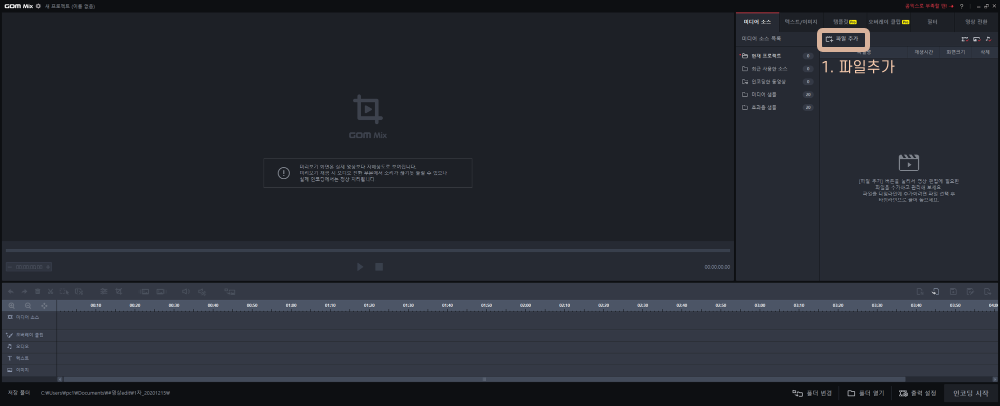
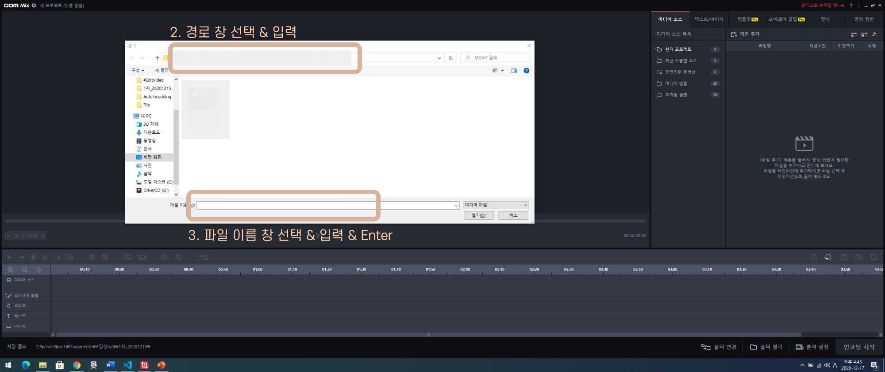
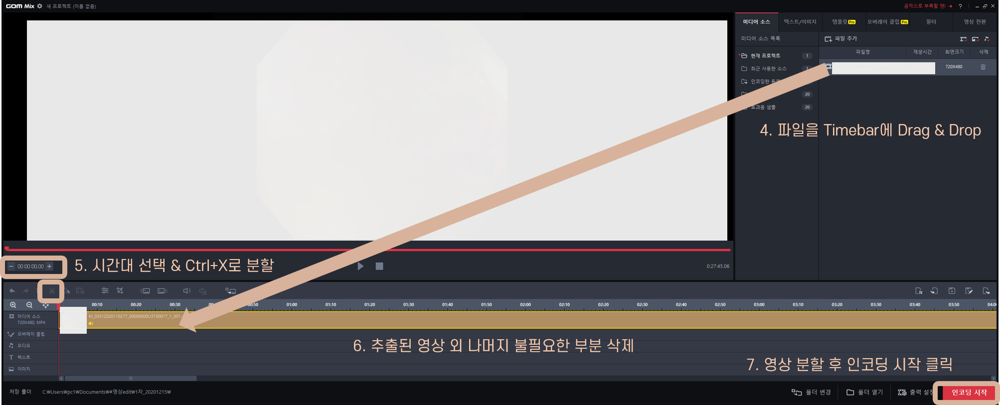
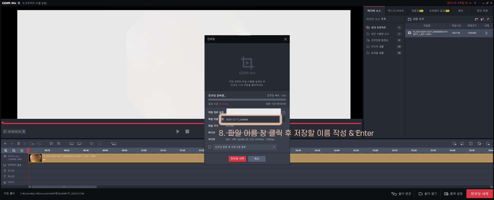

# 영상 편집 및 인코딩 자동화
- **목적:** 영상을 지정된 시간영역만 추출하고 인코딩을 반복하는 업무 자동화
- 목차
    - [개발 환경](#개발환경)
    - [기능개요](#기능개요)
    - [라이브러리](#라이브러리)
    - [중간 업데이트](#중간-업데이트)
  

## 개발환경
1. python 3.8.6 32bit 
2. pyautogui 0.9.52 _마우스 & 키보드 조작 자동화
3. pywinauto 0.6.8 _프로그램 실행 자동화
4. pandas 1.1.5 _미리 지정된 영상 제목, 편집시간 목록 불러오기 
5. PIL 8.0.1 _인코딩 완료 판별을 위한 좌표값 확인
  

## 기능개요
1. 곰믹스를 실행한다. (-> pywinauto로 실행 )
2. 다음과 같은 순서로 마우스조작이 이뤄진다(-> pyautogui로 실행) 
      
      
      
      
3. 
  

## 라이브러리
1. **Pywinauto**
    - pywinauto.application을 이용하여 GomMixMain.exe를 자동 실행 
        > app = application.Application().start('C:/Program Files (x86)/GOM/GOMMix/GomMixMain.exe')
2. **Pyautogui**
    - 윈도우 GUI에 접근하여 코드로 움직일 수 있게 해주는 Library
    > pyautogui의 간단 조작법 
      > pyautogui.position(): 현재 마우스 좌표 확인 
      > pyautogui.moveTo(x, y): (x,y)좌표로 마우스 이동 
      > pyautogui.click(): 현재 마우스 위치에서 클릭 
      > pyautogui.press('c'): c키 입력 
      > pyautogui.hotkey('ctrl', 'c'): 단축키 사용 
      > pyautogui.typewrite(" "): ""안의 TEXT입력(영어만 가능) 
      > 
        

        
        

  

## 중간 업데이트
 1. **이슈: 영상 인코딩되는 시간을 어떻게 기다렸다가 다음 코드로 넘어갈 것인가?**
    - 해결책1: pywinauto로 threshold에 할당된 cpu 할당량을 기반으로 wait 
        *-> cpu 할당량이 일정하지 않고, 또 정해놓은 임계점(5%)까지 내려오는데 많은 시간 소요 (폐기)*
         
    - 해결책2: PIL.ImageGrab을 이용하여 로딩창 픽셀의 색추출을 통해 확인 
    

 2. **이슈: 곰믹스의 영상 리소스 리스트가 240을 넘기면 프로그램이 다운된다.** 
    -> 해결: 영상 하나 작업할 때 마다 리소스 리스트에서 삭제